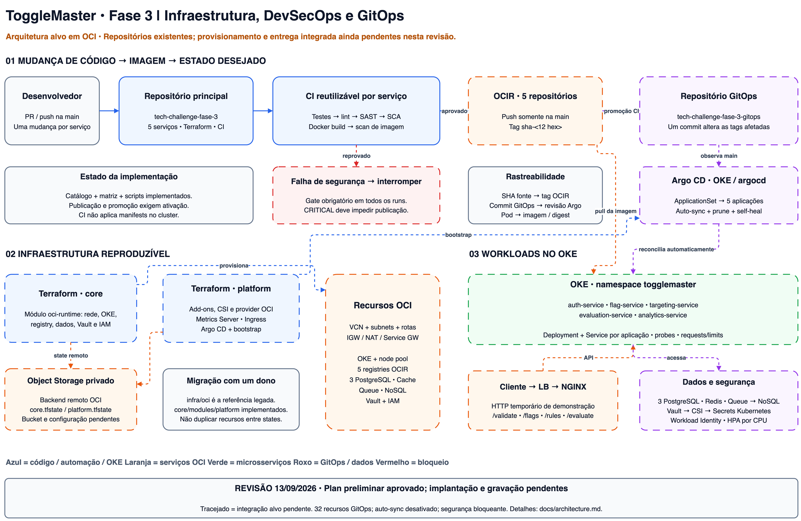
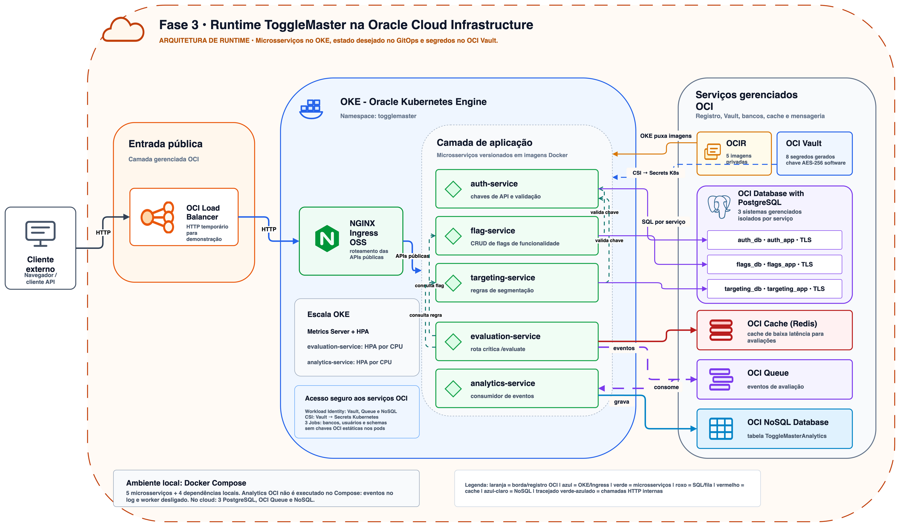

# Arquitetura — ToggleMaster Fase 3

A solução usa OCI, com substituição de provedor aceita pela disciplina. O Terraform define a infraestrutura e o Argo CD reconcilia os workloads a partir do repositório GitOps.

## Ambiente e organização Terraform

Usamos somente `homolog`, um ambiente temporário para demonstração. O enunciado não exige homologação e produção simultâneas. As três raízes separam responsabilidades, não duplicam ambientes:

| Raiz | Responsabilidade |
| --- | --- |
| `infra/environments/homolog/backend` | Bucket privado/versionado para states |
| `infra/environments/homolog/core` | Instancia o módulo `oci-runtime`, que contém rede, OKE, OCIR, dados, Vault e IAM |
| `infra/environments/homolog/platform` | Provider Helm instala CSI, provider OCI, Metrics Server, NGINX, Argo CD e bootstrap opcional |

`infra/modules/oci-runtime` agrupa os recursos OCI em arquivos por responsabilidade. Cada recurso possui um único proprietário. Os states de backend, core e platform usam chaves distintas no Object Storage privado. Os exemplos de backend contêm placeholders; os valores reais ficam em arquivos locais ignorados pelo Git.

## CI/CD e GitOps

1. PR e push na main selecionam serviços alterados; mudanças compartilhadas selecionam os cinco.
2. Cada serviço usa jobs de build/testes, lint, SAST/SCA e build/scan de imagem. A sequência é bloqueante. Trivy reprova CRITICAL; lint e SAST também não toleram falhas.
3. Somente push na main com `ENABLE_OCIR_PUBLISH=true` publica, após toda a matriz passar. Credenciais OCIR existem apenas no workflow separado de publicação. A imagem publicada é o artefato previamente escaneado.
4. Promoção, habilitada por `ENABLE_GITOPS_PROMOTION=true`, consolida tags `sha-<12 hex>` em um commit no repositório GitOps. CI não faz deploy e o gate agregado inclui publicação e promoção.
5. Argo CD monitora os overlays e reconcilia as aplicações com auto-sync habilitado para os serviços. A rastreabilidade é SHA fonte → tag/digest → commit GitOps → revisão Argo → imagem do pod.

Os manifests de aplicações e recursos compartilhados ficam exclusivamente no repositório GitOps, com cinco Deployments. A aplicação raiz tem bootstrap manual; as aplicações de serviços reconciliam automaticamente. O CI GitOps valida estrutura, renderização e segurança, mas não bloqueia por si só a reconciliação do Argo após um commit.

## Runtime e segredos

OKE Enhanced com dois workers E3; três PostgreSQL independentes para auth, flag e targeting; Redis para evaluation; Queue e NoSQL para analytics. Cinco registries privados OCIR. O Service do NGINX solicita o Load Balancer OCI, que deve ser removido enquanto o controller e o cluster ainda existem.

Vault gera oito segredos e o provider CSI usa Workload Identity. ConfigMaps contêm configuração não secreta. Jobs inicializam bancos e usuários restritos antes dos serviços. O pull secret OCIR tem bootstrap próprio, pois a imagem precisa ser obtida antes de montar os volumes CSI. Credenciais e planos/state não pertencem ao Git.

Compose oferece desenvolvimento local. A validação das integrações OCI exige o ambiente cloud e o smoke pelo ingress.

## Diagramas e documentos

As fontes `.drawio` são editáveis e `npm run diagrams:export` regenera os PNGs. Os desenhos representam a arquitetura; não são evidência de implantação.

- [Operação e encerramento](phase3-operations.md)
- [Estimativas AWS e OCI](costs/README.md)
- [Relatório da entrega](report.html)
- [Decisões](decisions/0001-repository-strategy.md)
