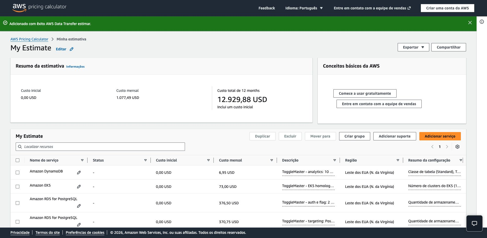
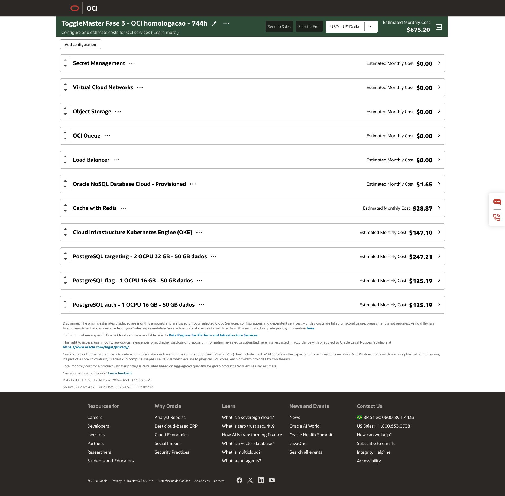

# Estimativas de custos — ToggleMaster / Fase 3

Preparadas em **13/09/2026**. Estas estimativas e seus prints são artefatos de entrega; o script auxiliar e notas de preparação ficam fora do Git em `phase3project/internal/costs/`.

## Totais

| Cenário | Período | Total USD |
| --- | --- | ---: |
| AWS — calculadora, sem descontos de Free Tier | 730 h | 1.077,49 |
| OCI — calculadora com franquias públicas | 744 h | 675,20 |
| OCI — mesmas franquias, normalizada | 730 h | 662,95 |
| OCI — sem franquias, normalizada para comparação | 730 h | 672,20 |
| OCI — sem franquias | 744 h | 684,62 |

A comparação mais conservadora no mesmo período é **AWS US$ 1.077,49 × OCI US$ 672,20**, ambas com 730 horas e sem abatimento de franquias/créditos. Isso compara capacidades aproximadas, não SLAs ou desempenho idênticos. O print OCI mostra US$ 675,20 porque o estimador usa 744 horas e suas franquias públicas.

## Abrir e recuperar

- [AWS: estimativa compartilhável completa](https://calculator.aws/#/estimate?id=b49777aec14492a057f24a0d2a39f829464dbd85). O site informa validade de um ano para o link. O link está também no JSON exportado.
- [OCI: calculadora oficial](https://www.oracle.com/cloud/costestimator.html). Para recuperar esta estimativa: menu `…` → `Import` → selecionar [oci-estimate.json](oci-estimate.json). A interface examinada oferece exportação/importação, mas não apresentou link público que incorpore a configuração; o endereço da calculadora sozinho não a restaura.
- [PDF consolidado](pricing-estimates.pdf), [PDF AWS](aws-estimate.pdf) e [PDF OCI](oci-estimate.pdf). PDFs montados localmente a partir das exportações e capturas oficiais; não são propostas comerciais.
- [Imagem AWS](aws-calculator.png), [itens adicionais AWS](aws-calculator-details.png), [imagem OCI](oci-calculator.png).
- [Exportação AWS](aws-estimate.json), [exportação OCI reimportável](oci-estimate.json), [planilha CSV](comparison.csv) e [totais JSON](totals.json).
- [Recorte de preços públicos OCI em USD](oci-price-list-usd.json), com SKUs e faixas usados na memória de cálculo. API atualizada em 2026-09-09T16:34:38.537Z.

## AWS — 730 horas

| Serviço | Premissa | USD/mês |
| --- | --- | ---: |
| DynamoDB provisioned capacity | ToggleMaster - analytics: 10 RCU, 10 WCU, 5 GB | 6.95 |
| Amazon EKS | ToggleMaster - EKS homologacao, suporte padrao, 730 h | 73.00 |
| Amazon RDS for PostgreSQL | ToggleMaster - auth e flag: 2 PostgreSQL, 2 vCPU/16 GiB cada | 376.50 |
| Amazon RDS for PostgreSQL | ToggleMaster - targeting: PostgreSQL 4 vCPU/32 GiB | 370.75 |
| Amazon EC2  | ToggleMaster - 2 workers x86 2 vCPU/8 GiB; EBS 50 GB cada | 134.14 |
| Amazon ElastiCache | ToggleMaster - Redis 1 node, 3.09 GiB (OCI 2 GB) | 49.64 |
| Public IPv4 Address | ToggleMaster - NAT regional 1 AZ, 10 GB/mes; 3 IPv4 publicos | 10.95 |
| Network Address Translation (NAT) Gateway | ToggleMaster - NAT regional 1 AZ, 10 GB/mes; 3 IPv4 publicos | 33.30 |
| Network Load Balancer | ToggleMaster - NLB TCP, 1 balanceador, 10 GB/mes | 16.49 |
| Amazon Elastic Container Registry | ToggleMaster - 5 repositorios privados, 5 GB totais | 0.50 |
| Amazon Simple Queue Service (SQS) | ToggleMaster - 100 mil requisicoes SQS Standard/mes | 0.04 |
| S3 Standard | ToggleMaster - estado Terraform versionado 1 GB, 1000 PUT e 10000 GET/mes | 0.03 |
| Data Transfer | ToggleMaster - estado Terraform versionado 1 GB, 1000 PUT e 10000 GET/mes | 0.00 |
| AWS Secrets Manager | ToggleMaster - 8 segredos, 10000 leituras de API/mes | 3.25 |
| AWS Key Management Service | ToggleMaster - 1 chave simetrica, 10000 requisicoes/mes | 1.03 |
| AWS Data Transfer | ToggleMaster - 10 GB saida internet + 1 GB inter-AZ/mes | 0.92 |

## OCI — cálculo por configuração

| Configuração | 744 h / franquias | 730 h / sem franquias |
| --- | ---: | ---: |
| Secret Management | 0.00 | 0.00 |
| Virtual Cloud Networks | 0.00 | 0.09 |
| Object Storage | 0.00 | 0.16 |
| OCI Queue | 0.00 | 0.02 |
| Load Balancer | 0.00 | 8.98 |
| Oracle NoSQL Database Cloud - Provisioned | 1.65 | 1.65 |
| Cache with Redis | 28.87 | 28.32 |
| Cloud Infrastructure Kubernetes Engine (OKE) | 147.10 | 144.41 |
| PostgreSQL targeting - 2 OCPU 32 GB - 50 GB dados | 247.21 | 242.67 |
| PostgreSQL flag - 1 OCPU 16 GB - 50 GB dados | 125.19 | 122.95 |
| PostgreSQL auth - 1 OCPU 16 GB - 50 GB dados | 125.19 | 122.95 |

Valores de linhas são arredondados para centavos; os totais são arredondados depois de somar os valores de precisão completa. Por isso, a soma visual pode diferir em centavos.

A conferência independente por SKU reproduziu o total visível de **US$ 675,20** da calculadora Oracle. PostgreSQL auth/flag: `744 × (0,098 + 0,030 + 16 × 0,002) + 50 × (0,072 + 30 × 0,0017)` por banco. Targeting: `744 × (2 × 0,098 + 2 × 0,040 + 32 × 0,0015) + 50 × (0,072 + 30 × 0,0017)`.

## Premissas e limites

1. Cotação preparada em 13/09/2026, em USD, sem impostos, câmbio, créditos promocionais ou descontos negociados. Nenhum recurso foi provisionado.
2. Regiões: AWS us-east-1 (N. Virgínia), OCI us-ashburn-1. A AWS é um cenário equivalente de capacidade; a infraestrutura implementada no projeto é OCI.
3. Dois workers x86: 2 vCPU/8 GiB cada na AWS (m6a.large); 1 OCPU/8 GB cada na OCI (E5 Flex). Boot: 50 GB por worker. Argo CD, ingress, CSI e metrics-server compartilham esses workers.
4. Três bancos independentes: auth e flag com 2 vCPU/16 GiB cada; targeting com 4 vCPU/32 GiB. AWS: db.r6i.large ×2 e db.r6i.xlarge ×1, Single-AZ. OCI: E5 Flex 1 OCPU/16 GB ×2 e Standard3 Flex 2 OCPU/32 GB ×1, um nó por banco, armazenamento local à AD.
5. Armazenamento dos bancos: hipótese de 50 GB por banco, não uma reserva de capacidade configurada no Terraform OCI. Na OCI, o preset oficial acrescenta computação, tarifa PostgreSQL, Database Optimized Storage e 30 VPU/GB (75.000 IOPS). Reconfirmar tier efetivo no plan/provisionamento; os dados faturados crescem com o uso.
6. Cache: um Redis OCI de 2 GB; o equivalente AWS usa cache.t3.medium de 3,09 GiB. NoSQL: 10 unidades de leitura, 10 de escrita e 5 GB. DynamoDB: item de 1 KB e leituras fortes; as unidades e garantias entre provedores não são idênticas.
7. Rede: um NLB AWS, NAT regional ativo em uma AZ, 3 IPv4 públicos (2 NLB + 1 NAT), 10 GB processados pelo NAT, 10 GB/mês no NLB, 0,1 conexão TCP/s por 1 segundo. OCI: um LB flexível de 10 Mbps. Egress: 10 GB/mês; AWS inclui mais 1 GB de transferência inter-AZ. NAT em uma AZ não oferece alta disponibilidade entre AZs.
8. Imagens e estado: 5 GB totais para cinco repositórios e 1 GB para versões do estado Terraform. S3: 1.000 PUT/LIST e 10.000 GET/mês. OCI: Object Storage agrega 6 GB e 20.000 operações/mês, incluindo uma margem de operações do registry.
9. Mensageria: AWS 100.000 solicitações Standard/mês; OCI 33.333 mensagens de 1 KB, uma por chamada, totalizando 99.999 PUT/GET/DELETE. Polling vazio, retries e mensagens adicionais exigem revisar essa hipótese.
10. Segredos: oito segredos; AWS inclui 10.000 leituras e uma chave KMS com 10.000 operações simétricas. OCI usa Vault DEFAULT, chave SOFTWARE e Secret Management gratuito; não foi precificado um Private Vault/HSM dedicado.
11. A calculadora OCI aplica automaticamente franquias públicas de LB, Object Storage, Queue e egress. A comparação conservadora retira essas franquias usando a faixa paga da API. O boot foi mantido pago em ambos os cenários. Não pressupomos que franquias compartilhadas pela conta estejam disponíveis.
12. Sem suporte pago, observabilidade externa, domínio/DNS pago, backups adicionais/retidos após exclusão, replicação regional ou tráfego extra. O custo do CI hospedado não integra a conta cloud. A estimativa não comprova desempenho, disponibilidade de shapes, quotas nem aceitação acadêmica da substituição AWS por OCI.
13. Conversão OCI para 730 horas: apenas itens cobrados por hora são ajustados. Armazenamento, unidades NoSQL e volumes mensais de operações permanecem constantes. Não multiplicar indiscriminadamente todo o total por 730/744.
14. Os preços são de ambiente ligado durante todo o mês. Para a gravação, calcular a janela real depois de definida; armazenamento, requisições, backups e recursos que permaneçam existentes não desaparecem ao parar os workers.

## Fontes oficiais

- [AWS Pricing Calculator — configuração salva](https://calculator.aws/#/estimate?id=b49777aec14492a057f24a0d2a39f829464dbd85)
- [Oracle Cost Estimator](https://www.oracle.com/cloud/costestimator.html)
- [Oracle: documentação da API pública de preços](https://docs.oracle.com/en-us/iaas/Content/Billing/Tasks/signingup_topic-Estimating_Costs.htm)
- [Oracle: API de preços](https://apexapps.oracle.com/pls/apex/cetools/api/v1/products/)
- [Oracle: preços PostgreSQL](https://www.oracle.com/cloud/postgresql/pricing/)
- [Oracle: chave protegida por software](https://www.oracle.com/security/cloud-security/key-management/)
- [Oracle: Secret Management gratuito](https://www.oracle.com/es/security/cloud-security/secrets/)

## Evidências

## Ajuste de shape na ativação

O preflight de cotas indicou apenas um PostgreSQL E5 e um E6 disponíveis. O banco flag usa E6 (1 OCPU/16 GB); auth permanece E5 e targeting Standard3. A estimativa oficial arquivada usou E5 para flag. No catálogo Oracle consultado, E6 usa US$ 0,03/OCPU-h (B111129) e US$ 0,002/GB-h (B111130), iguais aos componentes E5 usados no cálculo; a troca não altera o total estimado sob as mesmas premissas. Os exports originais do estimador foram preservados para rastreabilidade.
